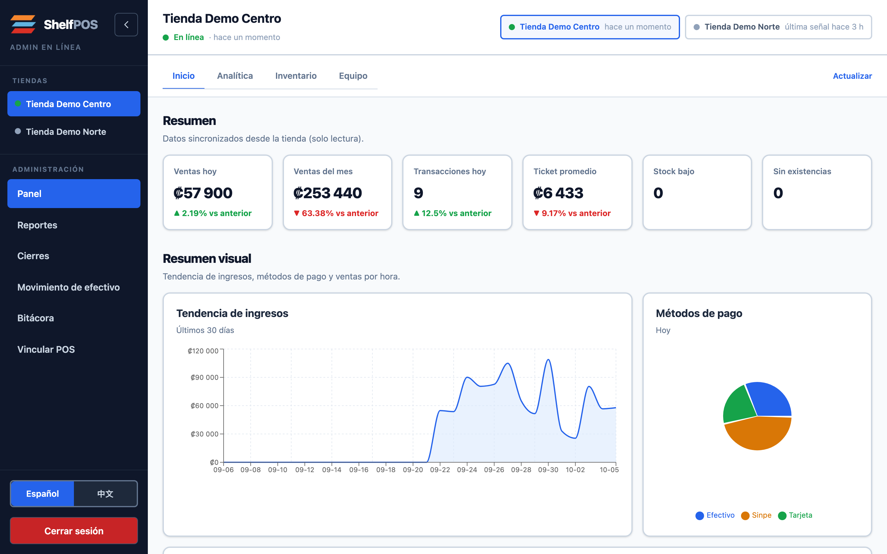
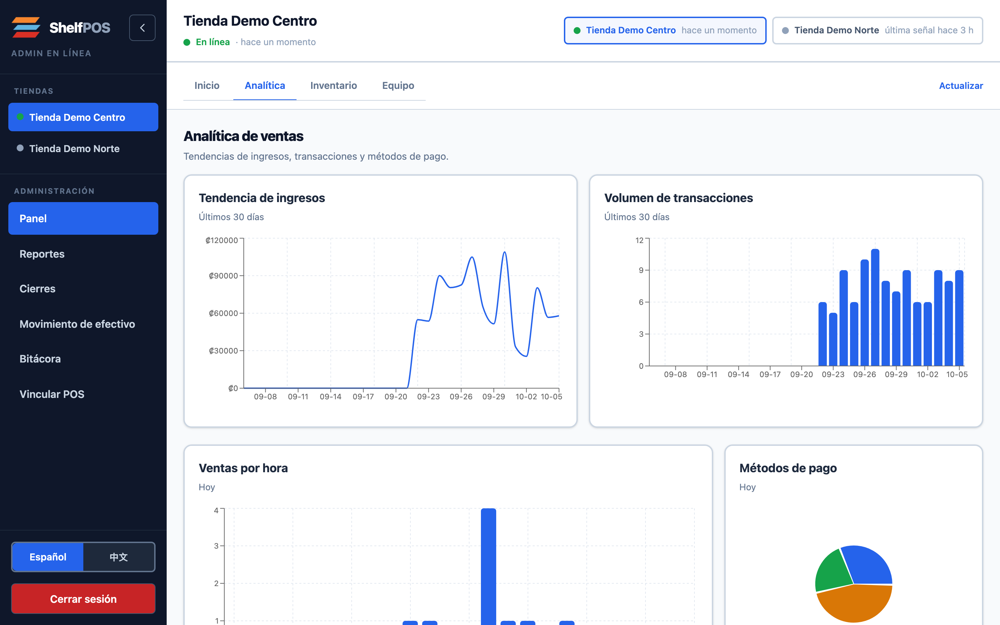
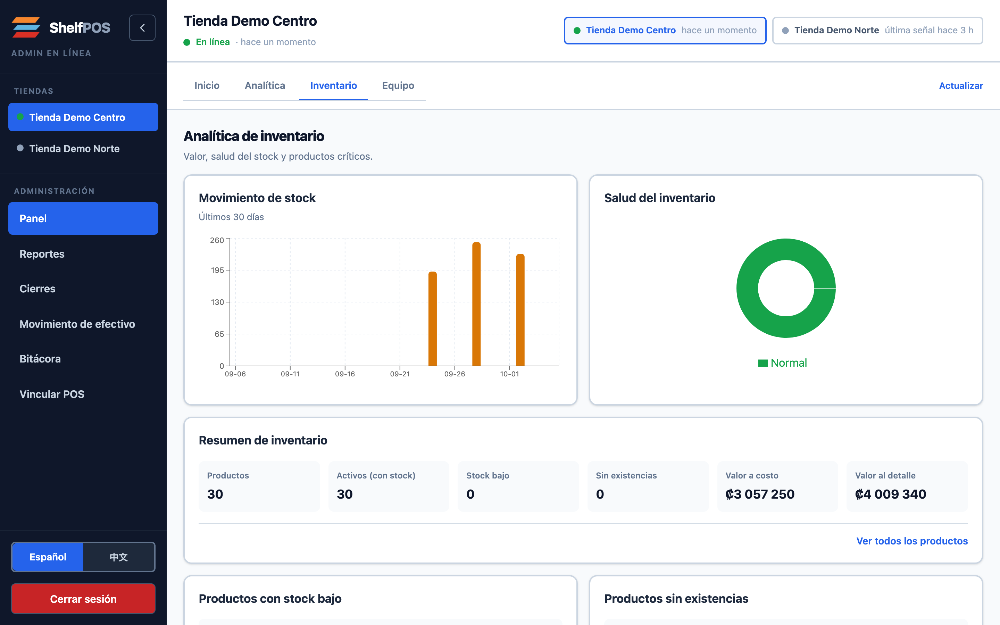
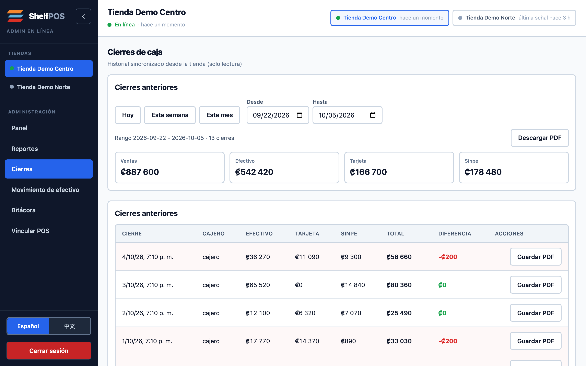
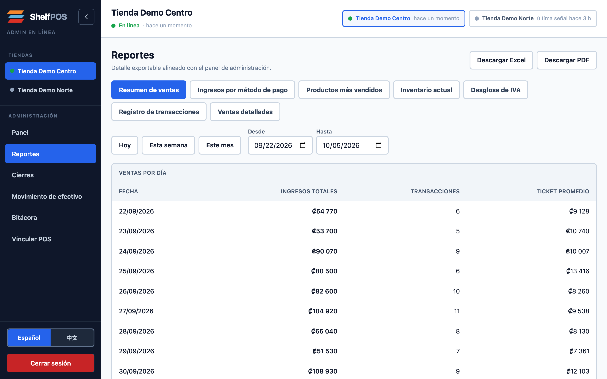

# ShelfPOS Dashboard

Read-only owner dashboard for [ShelfPOS](https://github.com/FortakenJay/ShelfPOS). Two live stores. TanStack Start on Vercel, backed by Supabase.

Each register sells from its own SQLite database. ShelfPOSSync pushes those rows up. This app only reads them. Owners can see sales and inventory from anywhere. They cannot edit the register from the cloud, so an online change cannot fight what happened in the store. Rows are keyed by store, and row-level security limits each owner to their own stores.



| Sales analytics | Inventory |
|---|---|
|  |  |
| **Cash closes** | **Reports** |
|  |  |

The screenshots use two demo stores with two weeks of generated shifts (opening float, sales, cash close), pushed through the real register app and exported with the sync service's mirror manifest. No store data.

## Setup

```bash
npm install
cp .example.env .env.local
# Fill in .env.local (see the table below)
npm run dev
```

Apply [`SUPA.sql`](SUPA.sql) in the Supabase SQL editor to create the mirror tables, RLS policies, and RPCs. `npm test` checks that file before running the unit tests.

## Env vars

| Variable | Where | Description |
| --- | --- | --- |
| `VITE_SUPABASE_URL` | browser | Supabase project URL |
| `VITE_SUPABASE_ANON_KEY` | browser | Publishable key; every read goes through RLS |
| `VITE_DASHBOARD_URL` | browser | Public URL used for auth email redirects |
| `VITE_SIGNUP_INVITE_KEY` | browser | Optional fallback for `/create-account?key=…` |
| `SUPABASE_SECRET_KEY` | server only | Secret key for operator API routes. Never prefix with `VITE_` |
| `DISCORD_BILLING_WEBHOOK_URL` | server only | Webhook for unpaid billing reminders |
| `BILLING_CRON_SECRET` | server only | Shared secret for `POST /api/cron/billing-reminders` |

## Deploy (Vercel)

1. Import this repo as a Vercel project (the app is at the repo root).
2. Add the env vars above.
3. Deploy. `vercel.json` sets the framework to TanStack Start.

## Features

- **Store switcher** with online/offline status from the last sync activity
- **Panel**: KPIs, sales trend, payments, top products, inventory
- **Reportes**: today / week / month summaries
- **Cierres**: read-only cash-close history with discrepancy highlighting
- **Auditoría**: synced audit log

Left in the register app on purpose: products, users, settings, print queue, export/backup.
